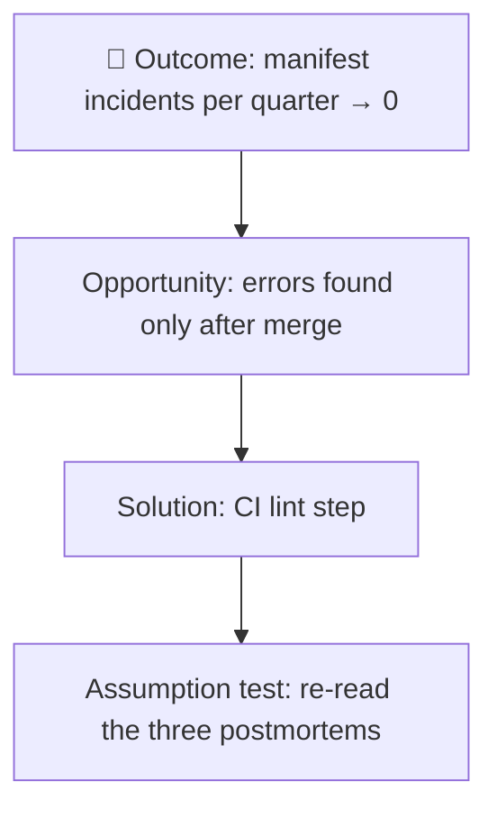

# Opportunity–Solution Tree — WidgetLint

- **Slug:** `widget-lint`
- **Last updated:** 2026-10-19

```mermaid
flowchart TD
    O["🎯 Outcome: manifest incidents per quarter → 0"]
    O --> OPP1["Opportunity: errors found only after merge"]
    OPP1 --> S1["Solution: CI lint step"]
    S1 --> A1["Assumption test: re-read the three postmortems"]
```

## Notes
- Outcome is a metric, not a feature.
